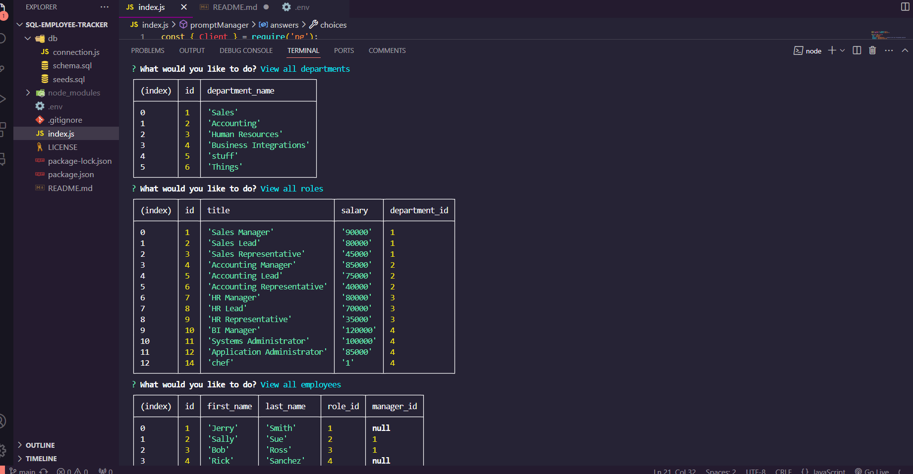

# sql-employee-tracker

## Description 
This is a command line application that allows the user to view employee data. 

## Installation
User must have node installed in order to run this application 

## Usage
Clone this repository to your local machine.  Install necessary dependancies.  
Initialize app by running 'node index.js' in your integrated terminal.
Once the app is started, the user will be prompted with several different actions.  The user will use the arrow keys in order to navigate the various prompts.  Once the user has completed answering all relavant prompts, the date will be added to the relavant table. 

## Screenshot of application

## Video Demo Link 

## GitHub Repo
https://github.com/ChrisReynolds0508/sql-employee-tracker

## Author
Chris Reynolds

## License
Please refer to license in repo 
